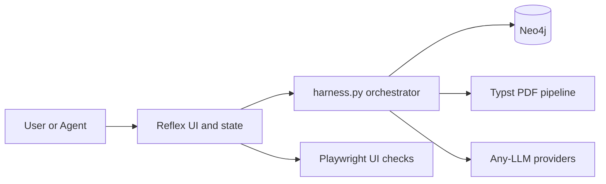

# LLM Harness


Ship long-horizon LLM agents that stay on spec, stay observable, and produce repeatable outputs.

LLM Harness is a deterministic, coverage-driven harness built on a real product surface. It is implemented as a full-stack resume builder
so UI, database, and PDF workflows are exercised under realistic load and failure conditions.

## Table of contents

- Overview
- Why teams use it
- What you get
- Architecture
- Quick start
- Local setup
- Inputs and data
- Common workflows
- State and logs
- Configuration
- Testing and safety
- Repo bootstrap
- Project structure
- Documentation
- Contributing
- Security
- License

## Overview

Long-running agent systems fail when requirements drift and verification is weak. LLM Harness enforces a finite-state workflow, captures
evidence for every change, and uses coverage-driven simulation to exercise DB, UI, and PDF branches in one place.

## Why teams use it

- Keep long-horizon agents aligned with explicit requirements and evidence trails.
- Stress real workflows instead of toy demos, including UI and PDF output.
- Get deterministic, repeatable runs that you can compare over time.

## What you get

- Finite-state agent protocol with requirement tracking (`AGENTS.md`)
- Coverage-driven simulation for Neo4j, UI, and PDF paths
- Dockerized end-to-end runner for repeatable validation
- Typst-based PDF rendering with deterministic layout
- Playwright UI checks with optional coverage logging
- Any-LLM provider abstraction for OpenAI and Gemini calls

## Architecture



## Quick start

```bash
# Start Neo4j
docker compose up -d neo4j

# Run maximum coverage, LLM calls skipped by default
python harness.py --maximum-coverage

# Compile a PDF for the current profile
python harness.py --compile-pdf /tmp/preview.pdf
```

## Local setup

Target environment: WSL2 with Ubuntu 22.04 or newer. The commands below assume a Debian/Ubuntu shell in WSL. If you use
Docker Desktop on Windows, enable WSL integration for your distro so `docker compose` works inside WSL.

Recommended (conda or mamba):

```bash
mamba env create -f environment.yaml
conda activate llm-harness
```

Pip fallback:

```bash
python -m venv .venv
source .venv/bin/activate
pip install -r requirements.txt
```

Typst is required for PDF output. Ensure `typst` is available on your PATH.

For parity with `--run-all-tests` outside Docker, install the same system tooling the Dockerfile uses.
Ubuntu/Debian example:

```bash
sudo apt-get update && sudo apt-get install -y \
  build-essential pkg-config curl ca-certificates gnupg git unzip xz-utils bzip2 \
  graphviz poppler-utils mupdf-tools shellcheck
```

Node 20 (matches the container runtime):

```bash
curl -fsSL https://deb.nodesource.com/setup_20.x | sudo -E bash -
sudo apt-get install -y nodejs
```

Then install the remaining pinned tools and browser deps:

- Typst v0.14.2 on your PATH.
- `shfmt` v3.8.0 and `hadolint` v2.12.0 on your PATH.
- `pip install semgrep==1.146.0`
- `python -m playwright install --with-deps chromium`

On macOS/Windows, install equivalents via your package manager and ensure versions align with the Dockerfile.

Neo4j is required for all database-backed flows. Choose one:

Option A (recommended, WSL): run Neo4j via Docker Compose.

```bash
docker compose up -d neo4j
```

Option B (local install): install Neo4j 5.x on WSL and ensure the service is running, then set:

- `NEO4J_URI` (default: `bolt://127.0.0.1:7687`)
- `NEO4J_USER` (default: `neo4j`)
- `NEO4J_PASSWORD` (default: `ResumeBuilder`)

## Inputs and data

- Prompt and requirement input: `prompt.yaml` plus `req.txt` or `--req-file`. The default `req.txt` is intentionally not tracked.
- Resume assets: import with `python harness.py --import-assets path/to/resume.json`.
- Reference asset schema: `michael_scott_resume.json`.

## Common workflows

```bash
# Dockerized end-to-end run, resets Docker state
python harness.py --run-all-tests

# Local container pipeline
python harness.py --run-all-tests-local

# UI checks, requires a running app
python harness.py --ui-playwright-check

# Docker-only UI checks
python harness.py --ui-playwright-check-docker
python harness.py --run-ui-tests

# Generate a profile from req input and render a PDF
python harness.py --generate-profile --req-file path/to/req.txt --compile-pdf /tmp/preview.pdf
```

## State and logs

The harness keeps a structured operational record in `docs/`:

- `docs/AGENT_STATE.md`: phase transitions, checkpoints, and key decisions.
- `docs/PLAN.md`: milestones, exit criteria, and dependencies.
- `docs/REQUIREMENTS.md`: requirement ledger with evidence.
- `docs/FEATURES.json`: machine-readable requirement status.
- `docs/TEST_LOG.md`: test runs, outcomes, and skips.
- `docs/KNOWLEDGE_BASE.md`: lessons learned and reusable procedures.

Runtime logs live in `maxcov_logs/` or `LLM_JSON_LOG_DIR` when enabled. Use `LLM_LOG_JSON_OUTPUT=1` to capture LLM JSON responses.

## Configuration

See `docs/CONFIGURATION.md` for full environment variable reference. Common values:

- `NEO4J_URI`, `NEO4J_USER`, `NEO4J_PASSWORD`
- `MAX_COVERAGE_LOG`, `REFLEX_COVERAGE`
- `OPENAI_API_KEY`, `GEMINI_API_KEY`, `GOOGLE_API_KEY`

## Testing and safety

Tests are optional and run only when explicitly requested. The Dockerized test gate resets containers, images, volumes, and networks and
requires an interactive TTY for sudo. Use non-production Neo4j targets only. See `docs/TESTING.md` for details and safety notes.

## Repo bootstrap

Use `tools/github_bootstrap.py` and `docs/GITHUB_BOOTSTRAP.md` to create or recreate the GitHub repo with standard settings.

## Project structure

- `harness.py`: CLI entrypoint for simulations, tests, and PDF generation
- `lib.typ`: Typst template and layout logic
- `scripts/`: automation for max-coverage and UI checks
- `docs/`: protocol state, plans, and long-run guidance
- `schemas/`: JSON schema for resume assets

## Documentation

- `AGENTS.md`: lifecycle protocol for long-run agents
- `docs/ARCHITECTURE.md`: system overview and components
- `docs/CONFIGURATION.md`: environment variables and provider setup
- `docs/TESTING.md`: test runners and caveats
- `docs/LONG_RUN.md`: long-run cadence and health checks
- `docs/README.md`: documentation index
- `reflex.md`: reference docs for the Reflex UI framework
- `select2.md`: Select2 integration notes

## Contributing

See `CONTRIBUTING.md` for development standards and PR guidance.

## Security

Report issues via `SECURITY.md`.

## License

See `LICENSE`.
